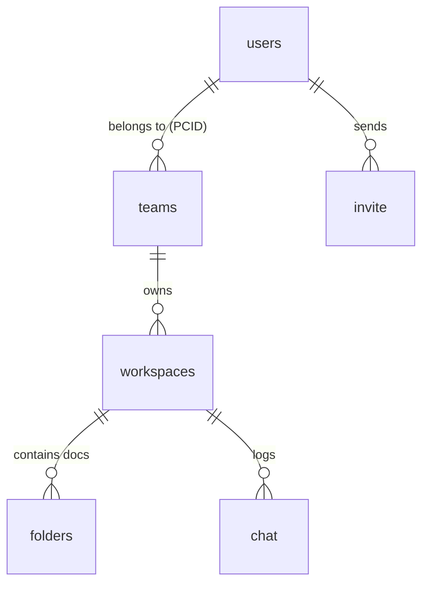

To align with your **Documentation Conventions & Standards**, I have integrated the **Front Controller / Request Lifecycle** details into the Master Manifest. This document now captures the "Invisible" routing logic along with the technical build and security rules.

---

<!--
Owner: Engineering Team
Last reviewed: 2026-05-16 (Integrated Front Controller & Request Lifecycle logic)
Scope: Master source of truth for LendingWise architecture, routing, security, and deployment.
-->

# 🗺️ LendingWise platform master manifest

The purpose of this document is to serve as the "Single Source of Truth" for the LendingWise application. It aggregates governance rules, the Front Controller request lifecycle, technical build instructions, and the automated release process.

## 🏗️ System architecture overview

LendingWise is a high-compliance fintech platform built for loan origination and management. 

- **Backend:** PHP 8.3 (Strict ORM usage)
- **Frontend:** HTML5, Bootstrap 4 (Metronic), jQuery
- **Database:** MySQL 8.0 (Multi-database: Main, API, Log, FCI, Chargebee, DataWarehouse)
- **Infrastructure:** Docker-based local development, AWS EC2 production
- **Pattern:** **Front Controller Pattern.** All non-static requests are routed through a single entry point.

## 🔄 Request lifecycle (Front controller)

The platform handles requests using a Front Controller pattern to ensure all logic passes through a central security and bootstrap layer.

1. **Browser Request:** A user hits a URL like `/dashboard`. No physical directory or file exists for this path.
2. **Web Server Check:** Apache checks the request against rules in `.htaccess`.
3. **Static File Bypass:** If the request is for a static asset (`.css`, `.js`, `.png`, `.pdf`), the server serves it directly for maximum speed.
4. **Internal Rewrite:** If not a static file, the rewrite rule fires. The URL in the browser address bar remains `/dashboard`, but the server internally forwards the request:
   - **Dev Environment:** Routes to `_index.php` (Enables Debug Mode).
   - **Prod Environment:** Routes to `index.php` (Enables Clean/Optimized Mode).
5. **PHP Routing:** The PHP application router analyzes the URI and determines which controller in `/pages/` to execute.

## 🔐 Governance and security rules

These rules are enforced via `AGENTS.md` and `CLAUDE.md` and are checked during PR reviews.

- **Tenant Scoping:** Every data query **must** filter by `PCID` or `FPCID`.
- **ORM Integrity:** Use `->Save()` to trigger **Automatic Field History** in `tblFileHistory`.
- **Input Sanitization:** All request parameters must use `Request::GetClean()`.
- **PII Protection:** SSNs, DOBs, and financial tokens must be masked in logs and never hardcoded.

## 🔧 Technical build and automation

The environment is strictly controlled via Docker and Makefiles to ensure consistency.

### Docker environment
The [Dockerfile](/Dockerfile) builds a PHP 8.3 image containing:
- **Extensions:** `imagick`, `mcrypt` (custom build), `bcmath`, `apcu`.
- **VHosts:** Manages `local.lendingwise.com`, `apilocal.lendingwise.com`, and `uploadlocal.lendingwise.com`.

### Makefile commands
- `make setup-local`: Full environment build and multi-repo sync.
- `make gen-db-models`: Rebuilds ORM wrappers after a database migration.
- `make test-phpunit-docker`: Runs the automated logic and security suite.

## 🚀 Release process flow

1. **Local Dev:** Use `make up` and work on a `claude/CU-` branch.
2. **Quality Gate:** Pull Request triggers `.deepsource.toml` scan and PHPUnit.
3. **Peer Review:** SR Dev reviews code against `Review.md` standards.
4. **Staging Release:** Push to `master` auto-deploys to Staging AWS for Cypress E2E testing.
5. **Prod Release:** Manual promotion of the Staging Docker image to the Production AWS account.

## 🛡️ Security monitoring (Snyk baseline)

The file `_snyk/snyk-20230621.txt` serves as our security benchmark.
- **Current Debt:** 1,834 [High] severity issues found in June 2023.
- **Target:** No new release may introduce vulnerabilities. Existing "High" issues (SQLi, Path Traversal) are being systematically replaced by ORM implementations.

## 📊 Data structure and ERD

The system relies on a workspace-based model scoped by Team (PCID).

## ## See Also
- [AGENTS.md](/AGENTS.md) - Master navigation and routing.
- [CLAUDE.md](/CLAUDE.md) - AI Git workflow and coding rules.
- [database-overview.md](DATA/database-overview.md) - Schema and ORM patterns.

**Last Updated:** 2026-05-16 (Integrated Front Controller and Snyk baseline)
**Owner:** Engineering Team