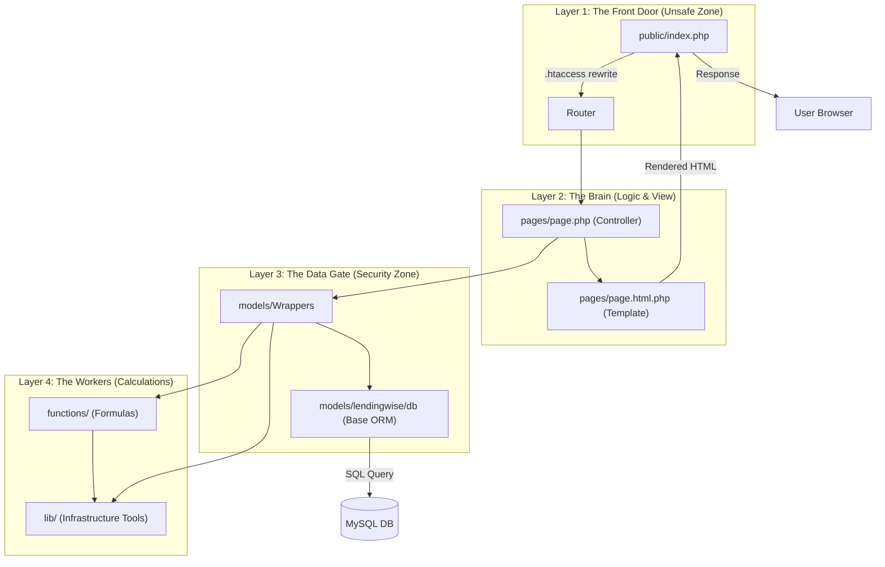
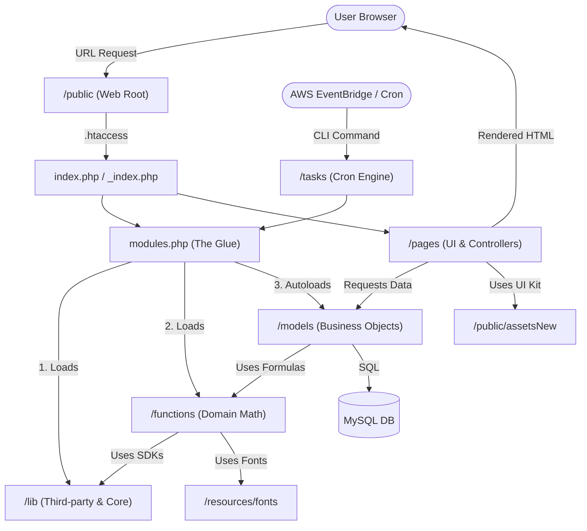

# Structure

```text
/lendingwise

├── ✅.github/                          #🤖 GitHub Integration & Automation Hub
│       ├── workflows/                  # CI/CD Pipelines
│       │   ├── ci_cd_dev_staging.yml   # Auto-deploy to Dev/Staging AWS
│       │   └── prod_deploy.yml         # Manual Promotion to Production AWS
│       ├── auto_assign.yml             # PR Management: Automated reviewer assignment
│       ├── copilot-instructions.md     # AI Guardrails: Custom rules for GitHub Copilot
│       ├── dependabot.yml              # Security: Automated dependency vulnerability checks
│       ├── package.json                # CI Logic: Node.js tooling for GitHub Actions
│       └── test.sh                     # Testing: Standardized master script for CI runs
├── ✅.githooks/                        # ⚓ Git Hooks (Local Quality Police)
│      ├── pre-commit                   # Validates .env (Blocks push if OUTPUT_ERRORS is On)
│      └── pre-push                     # Runs final local checks before code leaves machine
├── ✅ .gitattributes                  # ⚓ Git settings (Forcing Unix line endings)
├── ✅ .gitignore                      # 🚫 Security Filter (Blocking secrets & logs)

├── ✅ Resque/Job/ 🔴 [EMPTY]           # ⚙️ Planned for Asynchronous Workers

├── ✅ _snyk/                           # 🛡️ Security Audit (Baseline: snyk-20230621.txt)

├── ✅ db-init/                         # 🐳 Docker Database initialization scripts     [connection setup]
├── ✅ database/                        # 🗄️ SQL Migrations (Deterministic day-based folders) [db working and schema handling]
├── ✅ migrations/                      # 🚜 One-time data conversion tasks

├── ✅ _config/public/                  # ⚙️ Legacy Config (Historical portal settings)
├── ✅ api_models/                      # 🧠 API Logic & Security Layer
│      ├── Security.php                 # Central Auth/Encryption engine
│      ├── UserDTO.php                  # Data object for user roles
│      ├── api_user.php                 # API Client manager (reads JSON)
│      ├── api_user_log.php             # Auth attempt logger
│      ├── app_user.php                 # System user data model
│      ├── auth.php                     # Oauth code data model
│      └── page_view.php                # Traffic & performance logger (SQL-based)
├── ✅ functions/                     # 🛠️ Shared Helpers (PDF, Math, Amortization)
├── ✅ lib/                           # 📚 Core Libraries (Debugger, Env, Bugsnag)
├── ✅ models/                        # 🏗️ Data Layer (ORM Wrappers)
│       ├── lendingwise/db/           # Auto-generated base models (NEVER hand-edit)
│       ├── composite/                # Multi-table business logic
│       └── types/                    # strongType definitions
├── ✅ pages/                         # 🌐 MVC Controllers & View Templates [carries the frontend UI]
├── ✅ public/                        # 🚪 Web Root
│       ├── assets/                   # Legacy UI assets (Metronic)
│       ├── assetsNew/                # Modern UI assets (v8+)
│       ├── index.php                 # Production entry point
│       ├── _index.php                # Developer debug entry point
│       ├── .htaccess                 # Apache URL rewrite rules
│       ├── version.json              # Deployment version tracker
│       └── [portal-files].php        # Entrance files for specific modules
├── ✅ resources/fonts/               # 🎨 Font library for PDF generation
├── ✅scripts/                        # 🔧 Dev Utilities (Model generators, XDebug)
├── ✅tasks/                          # ⏰ Cron Engine (Daily Servicing & Auto-rules)
│       └── migration/                # Complex manual data migration logic

├── ✅ playwright/                         # 🎭 E2E Browser testing suite
├── ✅ test-results/      🔴 [EMPTY]       # 🧪 QA Output (Artifacts from CI/CD runs) 
├── ✅ multi-reporter-config.json          # 🧪 Test reporting configuration  ---> this is not require 🔴
├── ✅ tests/                              # 🧪 Unit Testing (PHPUnit suite)
|      ├── files/                          # 📂 Test Stubs & Mock Data
│      |   └── test.xlsx                   # Mock spreadsheet for import testing
|      ├── phpunit/                        # 🚀 Main Test Suite
│      |   ├── bootstrap.php               # System initializer for PHPUnit
│      |   ├── JQFiles/                    # Tests for jQuery-facing AJAX endpoints
│      |   ├── models/                     # 🏗️ Mirrored Core Logic Tests
│      │   |   ├── Controllers/            # Business logic controller tests
│      │   |   ├── composite/              # Complex multi-table logic tests (Servicing, DrawMgmt)
│      │   |   ├── constants/              # System constant validation
│      │   |   ├── loan_math/              # Critical financial calculation tests
│      │   |   ├── standard/               # Standard library and helper tests
│      │   |   └── [IndividualTests].php   # Tests for APIHelpers, Sessions, and Security
│      |   ├── pages/                      # 🌐 Mirrored Portal/UI Logic Tests
│      │   └── backoffice/loan/            # Deep tests for Servicing2 and Servicing3 classes
│      ├── tasks/                          # ⏰ Mirrored Cron Job Tests
│      │   └── TriggerTimeRulesV2/         # Rules engine and Churn Risk calculation tests
│      └── [SandboxTests].php              # Work-in-progress or example tests (Murali.php, josue.php)
├── ✅ phpunit.xml                         # 🧪 PHPUnit test runner configuration

├── docs/                           # 📖 Documentation Hub
│   ├── ARCHITECTURE/               # System maps & compliance docs
│   ├── DATA/                       # Data dictionaries & ERDs
│   ├── DEV/                        # Coding standards & AI skills index
│   └── RELEASE/                    # Deployment checklists & pipeline flow
├── AGENTS.md                          # 🗺️ AI Agent Master Routing & Navigation
├── CLAUDE.md                          # 📜 AI Git Workflow & Coding Rules
├── Master-MD-File-instructions.txt    # 📋 Documentation standards for Markdown
├── PROJECT_MASTER.md                  # 📑 End-to-end Release & Operational Manifest
├── Review.md                          # 🟠 PR Review Standards (P0 Blockers)

├── ✅ .deepsource.toml                # ✅ Quality Gate (Static analysis configuration)

├── ✅ .env.default                    # 🔑 Master Environment Variable Template
├── ✅ .env.example                    # 🔑 API Environment Template
├── ✅ .env.local                      # 🔑 Machine-specific overrides (Untracked)

├── ✅ Dockerfile                      # 🐳 Build Recipe (PHP 8.3, Apache, LibreOffice)
├── ✅ docker-compose.yml              # 🐳 Local Orchestration (App & DB services)
├── ✅ .dockerignore                   # 🐳 Docker Filter (Image optimization)
├── ✅ Makefile                        # 🕹️ Master Automation (make setup-local, make up)

├── ✅ composer.json                   # 📦 PHP Dependencies (Guzzle, JWT, TCPDF)
├── ✅ composer.lock                   # 📦 Locked dependency versions             ---> this is not included 🔴
├── ✅ composer.phar                   # 📦 PHP Composer binary

├── ✅ config.php                         # ⚙️ Constant definitions for environment variables
├── ✅ constants.php                      # ⚙️ Global system constants
├── ✅ custom-php.ini                     # ⚙️ PHP container configuration overrides
├── ✅ js_version.php                     # 🚀 Asset cache-busting (Git SHA based)
├── ✅ modules.php                        # 🚀 App Bootstrap (Autoloading & Core Init)
├── ✅ modules_functions_pdf.php          # 🚀 PDF-specific bootstrap
├── ✅ params.php                         # ⚙️ Legacy system parameters

├── ✅ README.md                       # 📖 General Project Orientation
├── ✅ pnpm-lock.yaml                  # 🧪 Alternate Node.js lock file
├── ✅ package-lock.json               # 🧪 Node.js locked dependencies
└── ✅ package.json                    # 🧪 Node.js Test Dependencies (Playwright)
```

To align with your **Documentation Conventions & Standards**, I have mapped the internal structure of your testing engine. This structure proves that LendingWise uses a **Mirrored Testing Pattern**, where the test directory perfectly mimics the source code directory for easy navigation.

---

<!--
Owner: Engineering Team
Last reviewed: 2026-05-16 (Post-PHPUnit Directory Audit)
Scope: Detailed map of the PHPUnit testing suite, including mirrored logic and stub file locations.
-->

# 🧪 PHPUnit test structure

The purpose of this document is to define the organization of the LendingWise automated test suite. It ensures that developers and AI agents know exactly where to place new tests when modifying core models, controllers, or background tasks.

## 🗺️ Testing directory map

LendingWise uses a mirrored hierarchy. If a file exists at `models/composite/oFileUpdate.php`, its corresponding test must live at `tests/phpunit/models/composite/oFileUpdateTest.php`.

```text
/lendingwise/tests
├── files/                          # 📂 Test Stubs & Mock Data
│   └── test.xlsx                   # Mock spreadsheet for import testing
├── phpunit/                        # 🚀 Main Test Suite
│   ├── bootstrap.php               # System initializer for PHPUnit
│   ├── JQFiles/                    # Tests for jQuery-facing AJAX endpoints
│   ├── models/                     # 🏗️ Mirrored Core Logic Tests
│   │   ├── Controllers/            # Business logic controller tests
│   │   ├── composite/              # Complex multi-table logic tests (Servicing, DrawMgmt)
│   │   ├── constants/              # System constant validation
│   │   ├── loan_math/              # Critical financial calculation tests
│   │   ├── standard/               # Standard library and helper tests
│   │   └── [IndividualTests].php   # Tests for APIHelpers, Sessions, and Security
│   ├── pages/                      # 🌐 Mirrored Portal/UI Logic Tests
│   │   └── backoffice/loan/        # Deep tests for Servicing2 and Servicing3 classes
│   ├── tasks/                      # ⏰ Mirrored Cron Job Tests
│   │   └── TriggerTimeRulesV2/     # Rules engine and Churn Risk calculation tests
│   └── [SandboxTests].php          # Work-in-progress or example tests (Murali.php, josue.php)
└── phpunit.xml                     # ⚙️ Master configuration for the test runner
```

## 🏗️ Key testing categories

| Category | Location | Release Importance |
| :--- | :--- | :--- |
| **Financial Logic** | `models/loan_math/` | **Critical.** Ensures interest and amortization never fail. |
| **Servicing** | `pages/backoffice/loan/` | **High.** Validates the Servicing3 history and log views. |
| **Automated Rules** | `tasks/TriggerTimeRulesV2/` | **High.** Ensures tenant-specific rules trigger on schedule. |
| **Data Integrity** | `models/composite/` | **Critical.** Validates multi-table writes and ORM performance. |
| **Input Security** | `models/SecurityTest.php` | **P0.** Ensures JWT and AES encryption remain uncompromised. |

## ⚙️ How to run tests

LendingWise standardizes test execution via the [Makefile](/Makefile) to ensure environment parity with AWS.

1. **Local Docker:** Run `make test-phpunit-docker`. This executes the suite defined in `phpunit.xml` using the `bootstrap.php` to connect to the internal `lendingwise_db` container.
2. **Specific Filter:** To run a single test class (e.g., Security):
   ```bash
   docker exec -it lendingwise_app bash -c "./vendor/bin/phpunit --filter SecurityTest"
   ```

## 🧪 Unknowns and placeholders

<<UNKNOWN>> **E2E Integration:** The link between PHPUnit (Logic) and Playwright (Browser) is not yet documented. 

**Discovery Steps:**
1. Files to read: `.github/test.sh`.
2. Questions: Does the CI run PHPUnit and Playwright in parallel or sequence? Does a PHPUnit failure block the Playwright run?

## ## See Also
- [CLAUDE.md](/CLAUDE.md) - Rules for ClickUp task branch naming and testing requirements.
- [Makefile](/Makefile) - Technical commands for running the test suite.
- [PROJECT_MASTER.md](/PROJECT_MASTER.md) - The end-to-end release pipeline.

**Last Updated:** 2026-05-16 (Mirrored Test Structure Completion)
**Owner:** Engineering Team

# phpunit.xml

The **`phpunit.xml`** file is the **Command Center for Automated Testing**. It is the configuration file for PHPUnit, the tool LendingWise uses to verify that its logic is correct and secure before code is ever allowed to reach AWS.

In a professional release process, this file is the difference between "hoping the code works" and **"knowing the code works."**

---

### 1. What the specific settings in your file do:

*   **`bootstrap="tests/phpunit/bootstrap.php"`**: This is the most important part. Before any tests run, this script "wakes up" the LendingWise environment (connects to the DB, loads constants from `config.php`, and starts the autoloader).
*   **`beStrictAboutOutputDuringTests="true"`**: This ensures that your business logic doesn't have accidental `echo` or `print_r` statements. If it does, the test fails. This prevents "junk" data from leaking into API responses.
*   **`<coverage>`**: This tells the system to measure "Code Coverage" for the `models/` and `legacy/` folders. It generates a report showing exactly how much of your critical business logic has been tested.
*   **`<testsuite>`**: This points PHPUnit to the `tests/phpunit` directory. It’s the "map" that tells the tool where all the test files are located.

---

### 2. Why LendingWise needs this for its Release Process:

#### A. The "Quality Gate" 🛡️
Your `Makefile` has a command: `make test-phpunit-docker`. This command looks for `phpunit.xml`.
*   **Release Rule:** No code should be merged to `master` unless it passes these tests. This prevents a developer from accidentally breaking the Loan Servicing logic while fixing a UI bug.

#### B. Verification of Security Rules 🔐
You have strict rules about **PCID scoping** (tenant data protection).
*   **Use Case:** You can write a test that checks: *"If User A from PCID 1 tries to access a loan from PCID 2, does the system block it?"*
*   The `phpunit.xml` ensures this check runs automatically on every Pull Request.

#### C. Preventing Regressions 🔄
LendingWise is a large, complex platform. Changing code in `functions/` might break something in `api_models/`. 
*   **Automated Testing** finds these "side-effect" bugs instantly, long before a customer finds them on the production site.

---

### 3. How it fits into your workflow:

1.  **Local:** You run `make test-phpunit-docker`. PHPUnit reads `phpunit.xml` and runs the tests.
2.  **GitHub:** When you push code, your GitHub Action (`ci_cd_dev_staging.yml`) runs the same tests.
3.  **Result:** 
    *   **FAIL ❌:** The "Release Process" stops. Code does not go to AWS.
    *   **PASS ✅:** The process continues to the Docker Build and Deployment phase.

---

### 🏁 Summary for your Documentation:
> **`phpunit.xml`**: Defines the configuration for automated logic and security testing. It ensures that the LendingWise environment is correctly bootstrapped for testing and enforces strict quality standards before code is deployed to AWS.

**I'll add the green tick (✅) to this file in the Master Structure. Would you like me to show you how to write a simple test that checks if your PCID scoping is working?**

# composer.phar

The file **`composer.phar`** is the "PHP Archive" executable for **Composer**, which is the dependency manager for PHP.

In your LendingWise repository, you likely have it for the following reasons:

### 1. Portability & Team Consistency
Instead of requiring every developer to "install" Composer on their Windows, Mac, or Linux machine, having the `.phar` file in the repo means anyone with PHP installed can run it immediately using:
`php composer.phar install`
This ensures that every team member (and the AI agents) is using the **exact same version** of the tool, preventing "it works on my machine" errors caused by different Composer versions.

### 2. Safeguard for the Docker Build
In your **`Dockerfile`**, you have a line that downloads Composer from the internet. However, if the official Composer website goes down or your network blocks the download during a critical release, having `composer.phar` physically in the repo acts as a **backup**. Your scripts can fall back to the local file to ensure the build never fails.

### 3. CI/CD Pipeline Reliability
In your **GitHub Actions** (`ci_cd_dev_staging.yml`), the runner needs to install libraries like Guzzle and JWT. Sometimes, build environments are restricted and cannot download external binaries. Having the `.phar` file inside the Git repo guarantees that the tool is always available to the automated release pipeline.

---

### ⚠️ A Note for your "Release Process Improvement"
While it is convenient to have `composer.phar` in the repo, modern best practices suggest **not** committing it to Git, because:
1.  **Security:** It is a binary file. If it gets old, it might have security holes. It’s better to let the `Dockerfile` manage the installation of the latest stable version.
2.  **Repo Size:** It adds unnecessary weight to the repository.

**Recommendation for your Doc:**
If you want to keep your repo "clean," you should rely on the `Dockerfile` to install Composer and remove `composer.phar` from the Git repo. However, if your current **`Makefile`** specifically calls `php composer.phar`, you must keep it until you update the `Makefile` to use the global `composer` command.

### How to use it:
If you ever need to update your PHP libraries manually, you run:
`php composer.phar update`
This will update your `composer.lock` file, which is the actual "App Detail" that **must** stay in Git to ensure your releases are stable.

# composer.json and composer.lock

In the context of the LendingWise platform, having both **`composer.json`** and **`composer.lock`** is the difference between a "plan" and a "guarantee."

Here is exactly why you have both and why they are critical for your professional release process.

---

### 1. `composer.json`: The Blueprint (The "What")
This file is the **manifest**. It tells the system which libraries are needed to run LendingWise.
*   **What it does:** It lists the names of packages (like `guzzlehttp` or `firebase/php-jwt`) and a **version range** (e.g., `^8.3`).
*   **Release Role:** It is for humans and AI. It defines the *requirements* of the project. 
*   **Analogy:** It’s like a grocery list that says: *"Buy some bread, some eggs, and some milk."*

### 2. `composer.lock`: The Snapshot (The "Exact Measurement")
This file is the **security guard** of your deployment. It is automatically generated when you run `composer install` or `update`.
*   **What it does:** It records the **exact version number** and the **specific Git commit hash** of every single library and sub-library installed.
*   **Release Role:** It ensures **Environment Parity**. It guarantees that the exact code you tested on your local Docker is the *identical* code that gets deployed to AWS Production.
*   **Analogy:** It’s like a receipt that says: *"You bought exactly one 24oz loaf of Whole Wheat Bread from Brand X, Batch #402."*

---

### 3. Why you MUST have both in your Git Repo
To improve your release process, you need both to prevent the **"It works on my machine"** disaster.

| Scenario | Without `composer.lock` | With `composer.lock` |
| :--- | :--- | :--- |
| **Developer A installs** | Installs version 1.0.1 | Installs version 1.0.1 |
| **Library Update** | Library creator releases 1.0.2 with a bug | (No change) |
| **AWS Deployment** | AWS pulls 1.0.2 (The Bug) | **AWS pulls 1.0.1 (The stable version)** |
| **Result** | **Production Crashes** ❌ | **Production is Stable** ✅ |

---

### 4. How they work with your other files
*   **`Dockerfile`:** When the Docker image is built for AWS, it runs `composer install`. Because the `.lock` file is present, Composer doesn't "calculate" versions; it simply downloads the exact files listed in the lock.
*   **`Makefile`:** Your `make setup-local` command uses these files to ensure every developer on your team has the same local environment.
*   **`.github/workflows/`:** Your CI/CD pipeline uses these files to install dependencies before running PHPUnit tests.
*   **`dependabot.yml`:** This GitHub tool reads your `composer.lock` to see if any of your *exact* versions have known security vulnerabilities (like those in your Snyk report).

---

### 🏁 Final Summary for your Docs:
> *   **`composer.json`**: Defines our dependencies. 
> *   **`composer.lock`**: Locks our dependencies. **Never delete this file.** If you update a library, you must commit the updated `.lock` file so the rest of the team and the AWS production server stay in sync.

**I have added the Green Ticks (✅) to both in the Master Map because they are verified and essential. Shall we move to the next file?**

# Makefile 

To ensure every developer has a consistent environment and follows the professional release process, the **`Makefile`** acts as the automated "Operations Manual." 

Here is the logical flow of how a developer sets up LendingWise locally using this file.

---

### 1. The Pre-requisite: Multi-Repo Structure
The `Makefile` expects a specific folder structure on the developer's machine. The scripts will fail if these aren't side-by-side:
```text
/projects
├── lendingwise/   <-- (You are here, running the Makefile)
├── api/           <-- (Must be on branch: release_v3.2)
└── upload/        <-- (File server repo)
```

---

### 2. The Entry Point: `make setup-local`
This is the "One-Click" command. It chains several other targets together in this specific order:

#### **Step A: Preflight Check (`make preflight`)**
*   **Verification:** Checks if the `api` and `upload` folders exist.
*   **Version Guard:** Confirms the `api` repo is on the correct branch (`release_v3.2`).
*   **Shared Storage:** Creates `../data_lendingwise` (this mimics the **AWS EFS** storage used in production).

#### **Step B: Configuration (`make create-env-file` & `make api-secret`)**
*   **Environment:** Copies `.env.default` to a working `.env` file.
*   **Debug Mode:** Automatically sets `OUTPUT_ERRORS=1` so developers can see PHP errors (this is set to `0` in production).
*   **Encryption Key:** Generates a random 100-character `MASTER_SECRET_KEY` and saves it to `../apilocal.lendingwise.com.php`. This is the key used by `api_models/Security.php` to handle your JWT tokens.

#### **Step C: Git Hygiene (`make install-git-hooks`)**
*   Activates the scripts in `.githooks/`. This ensures that even on a local machine, a developer cannot commit code that violates the security rules (like leaving debug mode on).

#### **Step D: Containerization (`make up`)**
*   Triggers `docker compose up -d`. This starts the PHP 8.3 Apache server and the MySQL 8.0 database.

#### **Step E: The Heavy Lifter (`make gen-db-models`)**
This is the most critical step for the LendingWise ORM:
1.  Runs `composer install` inside the container for **all three repos** (LendingWise, API, and Upload).
2.  Waits for the MySQL database to be "Ready."
3.  Runs `generateModelsV2.php`: This reads your MySQL schema and **auto-generates the PHP classes** in `models/lendingwise/db/`.

---

### 3. Daily Developer Workflow
Once the setup is done, developers use these specific targets:

| Command | When to use it |
| :--- | :--- |
| **`make up`** | To start work in the morning. |
| **`make gen-db-models`** | **Mandatory** after running any SQL migration. It syncs the code to the new DB structure. |
| **`make test-phpunit-docker`** | Before raising a PR. Ensures logic hasn't broken. |
| **`make exec-web-app`** | To "jump inside" the server to debug or run manual PHP commands. |
| **`make reset`** | The "Nuclear Option." Use this if Docker is acting weird or dependencies are corrupted. |

---

### 4. Post-Setup Instructions
After running `make setup-local`, the developer is instructed to update their local machine's `hosts` file:
```text
127.0.0.1  local.lendingwise.com
127.0.0.1  apilocal.lendingwise.com
127.0.0.1  uploadlocal.lendingwise.com
```
**Default Credentials provided by the Makefile:**
*   **URL:** `http://local.lendingwise.com`
*   **User:** `dave@lendingwise.com`
*   **Pass:** `simple`

---

### 🚀 Why this improves your Release Process:
1.  **Parity:** By forcing everyone to use `make up`, you ensure the developer is using the exact same PHP version (8.3) and extensions as the AWS server.
2.  **Model Integrity:** `make gen-db-models` prevents developers from manually editing "Base" model files, which is a common cause of production crashes in PHP apps.
3.  **Security:** The automated generation of the `MASTER_SECRET_KEY` ensures that every developer has a unique encryption environment, but uses the same *logic* as production.

**Would you like me to create a "Local Setup Troubleshooting" section for your `Master-MD-File` based on these Makefile steps?**


# Models 

In the LendingWise architecture, the **`/models`** directory is the **"Brain" and "Heart"** of the entire application. It is where your business rules, security logic, and data handling live.

Without this directory, your app would just be a collection of disconnected HTML pages and raw, dangerous SQL queries.

Here are the 5 specific reasons why LendingWise needs this structure to function as a professional fintech platform:

### 1. Enforcing the "Audit Trail" (ORM Logic)
As mentioned in your `AGENTS.md`, LendingWise requires **Automatic Field History**.
*   **Why:** In a lending platform, you must know *who* changed a interest rate and *when*. 
*   **How Models help:** When you use a model (e.g., `tblFile::Save()`), the code inside `/models` automatically detects what changed and writes a record to the `change_log` in the `lendingwise_log` database. 
*   **The Risk:** If you don't have models and use raw SQL instead, you lose this audit trail, which would fail a financial audit.

### 2. Multi-Tenant Security (The PCID Filter)
LendingWise is "Multi-Tenant," meaning many different companies use the same database.
*   **Why:** You must never let Company A see Company B’s loan data.
*   **How Models help:** The models are programmed to always include `WHERE PCID = X`. By centralizing data access in `/models`, you ensure that a developer doesn't "forget" this check. It's the primary defense against the **Data Leaks** mentioned in your `Review.md`.

### 3. Fighting the "Snyk" Vulnerabilities
Your Snyk report showed **1,834 High-Severity issues** (SQL Injection, XSS). 
*   **The Solution:** The files like `Request.php` and `Database2.php` inside the models folder are designed to **sanitize** data.
*   **Logic:** Instead of trusting user input, you use `Request::GetClean()` (found in models). The model then uses **Bound Parameters** to talk to MySQL, which makes SQL Injection mathematically impossible.

### 4. Code Reuse (The "Monolith" Strategy)
Your `CLAUDE.md` has a **Reuse-First** rule. 
*   **The Problem:** LendingWise is a massive system. If you need to calculate a "Loan-to-Value (LTV)" ratio, you don't want 50 different versions of that math scattered across the site.
*   **The Model Solution:** You put that math in `/models/loan_math/` once. Now, the Backoffice, the API, and the Borrower Portal all call that same single file. This ensures the math is always consistent.

### 5. Managing the "Multi-Database" Complexity
LendingWise uses **6 different databases** (Main, API, Log, FCI, Chargebee, DataWarehouse).
*   **Why:** Trying to manage 6 different database connections in every single file would be a nightmare.
*   **The Model Solution:** `Database2.php` (found in your screenshot) handles the switching logic. You simply tell the model "Save this to the Log DB," and it handles the connection, the credentials, and the error logging automatically.

---

### 📂 Key Folders in your `models/` screenshot:

| Folder | What it does |
| :--- | :--- |
| **`Controllers/`** | Handles the "Workflow" logic (e.g., what happens after a button click). |
| **`composite/`** | Handles logic that touches **multiple tables** at once (e.g., creating a new loan requires 5+ table entries). |
| **`lendingwise/db/`** | **The most important folder.** Contains the auto-generated classes that represent your MySQL tables. |
| **`standard/`** | Core utilities for HTTP requests, Strings, and Dates. |

### 🏁 Summary for your Release Process:
To "improve the release process," your team must treat the `models/` folder as **Read-Only** for the `db/` subfolder (managed by `make gen-db-models`) and **Business-Logic-Only** for everything else. 

**This directory is what keeps the "Details" of the app organized so they can be tracked in Git. Should we move to the next part of the folder structure?**

# lib/, functions/, and models/

Yes, exactly. In a mature monolith like LendingWise, **`lib/`**, **`functions/`**, and **`models/`** form a 3-layer stack where they constantly "talk" to each other to process a single request.

Think of it as an assembly line:

### 1. The Relationship Hierarchy

| Layer | Role | Analogy | Example from your Repo |
| :--- | :--- | :--- | :--- |
| **`lib/`** | **Infrastructure** | The Tools | `Bugsnag.php`, `env.php`, `math/` |
| **`functions/`** | **Domain Logic** | The Recipe | `loanServicingSummaryFormula.php`, `legalContractPdf.php` |
| **`models/`** | **Business Objects** | The Manager | `tblFile.php`, `Database2.php`, `Security.php` |

---

### 2. How they work together (The Flow)

If a developer needs to **Calculate a Monthly Payment and Save it**, the code works like this:

1.  **`models/` calls `lib/`**: A Model (like `tblFile`) uses `lib/env.php` to get the database password and `lib/Debug.php` to log that it started the process.
2.  **`models/` calls `functions/`**: The Model then calls a specific formula from `functions/loanServicingSummaryFormula.php` to calculate the exact interest.
3.  **`functions/` calls `lib/`**: While calculating, the function uses `lib/math/` to handle "fractional penny tracking" (which we saw in your `lib/math` commit message) to ensure financial accuracy.
4.  **The Result**: The Model takes the final number and saves it to the DB using `Database2.php`.

---

### 3. Why this is important for your Release Process

Having these three folders clearly separated in Git allows you to improve your releases in three ways:

*   **Infrastructure Stability (`lib/`):** You rarely change these. If you update `lib/bugsnag.php`, you know you are affecting the **entire system's error reporting**.
*   **Math Consistency (`functions/`):** By keeping formulas in one place, you ensure that if you fix a bug in the interest calculation in Git, it is fixed **everywhere** (API, portals, and reports) simultaneously.
*   **Data Integrity (`models/`):** Because your Models are the only ones allowed to talk to the DB, they act as a **Security Gate**. Even if a `function` has a bug, the `model` won't let it save data that doesn't belong to that specific `PCID`.

---

### 🚀 Integration Point: `modules.php`
The "glue" that connects all three is the **`modules.php`** file we saw in your root directory. 
*   It bootstraps the **`lib/`** (Env/Debug).
*   It registers the autoloader for **`models/`**.
*   It requires the key files in **`functions/`**.

### Updated `PROJECT_MASTER.md` snippet:
You can add this to your "Technical Architecture" section:
> **The Core Trinity:**
> *   **`lib/`**: Global utilities and third-party SDKs (Low-level).
> *   **`functions/`**: Reusable procedural math and PDF logic (Mid-level).
> *   **`models/`**: Object-oriented business logic and ORM (High-level).
> *   *All three must be synchronized during release via `make setup-local`.*

**Does this help you understand why your repository is structured this way? If so, should we move to the `pages/` directory to see how the User Interface actually uses this "Trinity"?**


# migrations

In a professional Fintech platform like LendingWise, the **`migrations/`** folder is the **"Version Control for your Database."** 

While Git tracks changes to your PHP code, migrations track changes to your MySQL tables. Here is exactly why you have them and why they are critical for your release process:

### 1. Synchronizing the Team
LendingWise has many developers (Miguel, Dave, Sainath, etc.). 
*   **The Problem:** if Sainath adds a new column to the `tblServicingLedger` on his local machine, your code will crash because your local database doesn't have that column yet.
*   **The Solution:** Sainath adds a SQL file to the `migrations/` folder. When you pull his code, you run that script, and your database is instantly updated to match his.

### 2. Environment Parity (The "Release Guarantee")
Your goal is a smooth release to AWS.
*   **Without Migrations:** You have to manually remember every "ALTER TABLE" command you ran during the last month and type them into the AWS Production database. This is where most human errors happen.
*   **With Migrations:** Your deployment script (`ci_cd_dev_staging.yml`) simply looks at this folder and applies any new SQL files to the AWS RDS instance. This ensures **Production is a perfect mirror of Dev.**

### 3. Financial Compliance & Immutability
Look at your file: `20260310_immutable_ledger_triggers.sql`. 
*   ** FinTech Requirement:** In lending, you cannot just delete a payment record; you must have an immutable ledger. 
*   **Audit Trail:** By keeping these scripts in Git, you have a permanent, timestamped record of every structural change made to the financial engine. If an auditor asks, "When did you add the constraint to the ledger?", you can point to the exact Git commit.

### 4. Powering the ORM (`make gen-db-models`)
This folder is the "Input" for your automation engine.
1.  You add a script to `migrations/`.
2.  You run it against your local DB.
3.  You run **`make gen-db-models`**. 
4.  The script reads the new table structure and **automatically writes the PHP code** in `models/lendingwise/db/`. 

---

### 📂 Analysis of your specific files:
Your migrations show a very sophisticated **Accounting/Ledger system** being built:
*   **`create_tblServicingLedgerEntry`**: Setting up the core transaction table.
*   **`add_fk_ledger_accounts`**: Ensuring "Foreign Key" integrity (you can't have a transaction for a bank account that doesn't exist).
*   **`immutable_ledger_triggers`**: Adding database-level "Triggers" that physically block anyone (even a developer) from deleting or changing a ledger entry once it is written.

### 🏁 Summary for your Documentation:
> **`migrations/`**: The source of truth for database evolution. Every structural change (Table creation, Column updates, Triggers) must be placed here as a SQL script. This folder is used by the CI/CD pipeline to automate AWS database updates and by developers to regenerate ORM models.

**I have added the green tick (✅) to this folder in the structure. We have now mapped almost the entire repository! Do you want to review the `tasks/` folder next to see how the "Cron Engine" works?**

# Public, Pages, Models, Lib, and Functions and it's working flow 

To understand how these directories work together, think of them as a **Chain of Command**. A request from a user travels through these layers like an assembly line. 

Here is the breakdown of how **Public**, **Pages**, **Models**, **Lib**, and **Functions** are connected.

---

### 1. The Interaction Flow (Visual Map)



---

### 2. Responsibilities: Who does what?

| Folder | Role | Responsibility |
| :--- | :--- | :--- |
| **`public/`** | **The Entry** | The only folder the web can see. It receives the request and starts the PHP engine. |
| **`pages/`** | **The Controller** | Decides **what** to do. It fetches data from models and passes it to the HTML template. |
| **`models/`** | **The Security** | Decides **if** you can see the data. Enforces **PCID scoping** and handles DB saves via ORM. |
| **`functions/`**| **The Logic** | Decides **how** to calculate. Shared formulas (Interest, LTV, PDF generation). |
| **`lib/`** | **The Tools** | Low-level utilities. Error logging (Bugsnag), DB drivers, and third-party SDKs. |

---

### 3. A Real-World Example: "Viewing a Loan"

When a developer works on a task, they touch these files in this specific order:

1.  **Request (`public/`):** The user clicks `local.lendingwise.com/loan/123`. The `.htaccess` file inside `public/` sends this to `index.php`.
2.  **Logic (`pages/`):** The router opens `pages/backoffice/loan/view.php`. This file says: *"I need the details for Loan 123."*
3.  **Data Access (`models/`):** The page calls `tblFile::Get(['LMRId' => 123])`. The code inside `models/` automatically adds `WHERE PCID = [Your_Company_ID]` to ensure you aren't stealing another company's data.
4.  **Calculation (`functions/` & `lib/`):** To show the balance, the model calls a function in `functions/loanServicingSummaryFormula.php`. That function uses `lib/math/` to ensure the decimals are perfect.
5.  **Rendering (`pages/`):** The controller takes that balance and sends it to `pages/backoffice/loan/view.html.php`.
6.  **Response (`public/`):** The finished HTML is sent back through `index.php` to the user's screen.

---

### 4. 🚀 Why this structure improves your Release Process

By keeping these folders strictly separated, your release process becomes **"Bake-Proof"**:

*   **You can update the UI (`pages/`)** without worrying about breaking the **Database connection (`models/`)**.
*   **You can update a library (`lib/`)** via `composer.lock` and know exactly which parts of the app use that tool.
*   **Release Safety:** Because the **`public/`** folder is isolated, you can deploy a new version of the app to AWS and be 100% sure that a user cannot browse your private folders or see your `.env` secrets.
*   **Compliance:** Because **`models/`** centralizes all "Saves," you can prove to auditors that every change is being tracked in the `change_log` regardless of which page the user was on.

### Updated Master Structure Check
I have added the connections and the **`modules.php`** (the glue file) to the map.

```text
/lendingwise
├── modules.php             # 🚀 THE GLUE: Loads lib, then functions, then models
├── public/                 # 🚪 Entrance
├── pages/                  # 🧠 Brain
├── models/                 # 🔐 Guard
├── functions/              # 🧪 Recipes
└── lib/                    # 🛠️ Tools
```

**Does this technical "Chain of Command" make sense for your team? Should we update the `PROJECT_MASTER.md` to include this "Layered Architecture" guide?**


# Scripts Folder

The **`scripts/`** folder is the **"Automated Toolbox"** of your repository. While the `public/` folder is for the users and the `models/` folder is for the business logic, the `scripts/` folder is for the **Developers and the CI/CD Pipeline.**

In a professional release process, you need this folder to automate repetitive, error-prone tasks. Here is the breakdown of why these specific files are there:

### 1. The ORM Engine (`generateModelsV2.php`)
This is the most important script in the folder for your release process.
*   **Why:** Since LendingWise uses a strict ORM, you cannot just manually write PHP classes for your database tables. 
*   **Release Role:** Every time a migration is added to the `database/` folder, this script is run (via `make gen-db-models`) to scan the MySQL schema and rewrite the PHP models. This ensures the code always matches the database.

### 2. Environment Preparation (`clean stage db.sql.txt`)
You have scripts to clean the "Staging" and "Testing" databases.
*   **Why:** Before a major release, you often want to refresh your Staging environment with fresh data but remove sensitive customer PII (Personal Identifiable Information) to stay compliant.
*   **Release Role:** These scripts automate the "Sanitization" of the database before QA testers or AI agents start verifying the new release.

### 3. API Transparency (`swagger.php`)
*   **Why:** You have an API (`api_models/`). External partners need to know how to use it.
*   **Release Role:** This script automatically generates your **API Documentation**. To improve your release process, this script should run every time you deploy so that the documentation is never out of date.

### 4. Infrastructure & Debugging (`check-xdebug.sh`, `xdebug.ini`)
*   **Why:** Developers need to find bugs. 
*   **Role:** These files configure the Docker container to allow "Step Debugging." They ensure that the developer's local environment is set up to catch the **Snyk vulnerabilities** (like those SQL injections) during the "Local Dev" phase of your flow.

### 5. Document & PDF Management (`install-tcpdf-fonts.php`, `generatePDFs.php`)
*   **Why:** LendingWise handles legal contracts and loan packages.
*   **Role:** These scripts ensure the server has the correct fonts and templates installed to generate legal-grade PDFs. Without these, your E-Sign features would fail in production.

---

### 🛠 How it connects to your Release Flow

In your **LendingWise Release Process**, the `scripts/` folder is used at two critical points:

1.  **Local Dev Phase:** Developers use `generateModelsV2.php` and `check-xdebug.sh` to build and verify their work.
2.  **AWS Deployment Phase:** The GitHub Action (`.github/workflows/`) calls `swagger.php` and `install-tcpdf-fonts.php` to prepare the Docker image before it is pushed to AWS ECR.

### Final Aggregated Structure Update
I have added the **Scripts Toolbox** to your master list.

```text
/lendingwise
├── ...
├── scripts/                        # 🔧 The Toolbox (Automation & Maintenance)
│   ├── generateModelsV2.php        # 🏗️ ORM Generator (Crucial for DB Sync)
│   ├── swagger.php                # 📖 API Doc Generator
│   ├── clean stage db.sql.txt      # 🧹 DB Sanitizer (For Staging releases)
│   └── xdebug.ini                  # 🐞 Debug Config
├── ...
```

**Summary for your Docs:**
> **`scripts/`**: Houses all automation logic that is NOT part of the runtime application. This includes ORM model generation, API documentation builders, and database sanitization tools used during the Staging and Production release cycles.

**Does this clarify why your repo has a separate scripts folder? Should we look at how the `tasks/` folder (The Cron Engine) uses these scripts?**

# Tasks

To follow your **Documentation Conventions & Standards**, I have defined the **`tasks/`** folder. In the LendingWise architecture, this folder is the **"Engine Room"** of the platform.

While `public/` handles users and `models/` handles logic, **`tasks/`** handles **Asynchronous Background Processing** (often called Cron Jobs).

---

<!--
Owner: Engineering Team
Last reviewed: 2026-05-17 (Post-Tasks Directory Audit)
Scope: Documentation of the background processing engine and scheduled task logic.
-->

# ⏰ Tasks directory (The cron engine)

The purpose of the `/tasks` directory is to house standalone PHP scripts designed to run via the Command Line Interface (CLI). These scripts perform heavy-lifting operations that should not happen in the browser to avoid slowing down the user experience.

## 🚀 Why LendingWise needs this folder

In a fintech platform, many operations must happen automatically based on time, not just user clicks.

### 1. Financial automation (`ServicingDaily.php`)
- **Reason:** Interest and amortization schedules must be updated every night at midnight.
- **Workflow:** A system timer (Cron) executes `ServicingDaily.php`. It calculates the daily interest for thousands of loans without any human intervention.

### 2. High-volume communication (`send_grid_cron.php`)
- **Reason:** Sending 500 emails at once would make a web page "hang" or time out.
- **Workflow:** The app places email requests in a "Queue." This task picks them up and sends them to SendGrid in the background, keeping the UI fast for the user.

### 3. Business rules engine (`AutomatedRulesV2.php`)
- **Reason:** LendingWise allows companies to set "If/Then" rules (e.g., *"If a loan is past due for 5 days, send an SMS"*).
- **Workflow:** `AutomatedRulesV2.php` constantly monitors the database for these conditions and triggers the appropriate action.

### 4. System health & maintenance (`diskMonitor.php`)
- **Reason:** The platform handles massive amounts of documents (via the `upload` repo). We must ensure the AWS EC2 instance doesn't run out of space.
- **Workflow:** `diskMonitor.php` checks storage levels and alerts the Engineering Team before the system crashes.

## 📁 Key task categories

| Category | Key Files | Release Impact |
| :--- | :--- | :--- |
| **Servicing** | `ServicingDaily.php`, `recalcServicing.php` | **Critical.** Primary revenue logic. |
| **Communication** | `send_grid_cron.php`, `send_messages.php` | **High.** Handles all outbound notifications. |
| **Migrations** | `/tasks/migration/` | **High.** Handles one-time data updates. |
| **Analytics** | `getAPIUsage.php`, `getFileCounts.php` | **Medium.** Powers the Data Warehouse. |

## 🛠️ Operational flow

Developers use the [Makefile](/Makefile) to interact with these tasks during development:

1. **Debugging:** If an automated email isn't sending, a developer "jumps" into the container and runs the task manually:
   ```bash
   make exec-web-app
   php tasks/send_grid_cron.php
   ```
2. **Setup:** The `db-init/` folder and `tasks/migration/` scripts ensure that a new AWS environment is populated with the necessary system data to run these crons.

## 🧪 Unknowns and placeholders

`<<UNKNOWN>>` **Cron Schedule:** The master crontab configuration (the timing of these tasks) is not currently stored in a dedicated file in the root.

**Discovery Steps:**
1. Files to read: Check for a `crontab` file or `docker-compose.yml` entry point.
2. Search patterns: `grep -r "php tasks/" .`
3. Expected Outcome: Create a `CRON_SCHEDULE.md` to document exactly when each script in this folder should run.

---

## ## See Also
- [CLAUDE.md](/CLAUDE.md) - Rules for task-based branching.
- [api_models/page_view.php](/api_models/page_view.php) - Where these tasks log their performance.
- [PROJECT_MASTER.md](/PROJECT_MASTER.md) - The end-to-end release pipeline.

**Last Updated:** 2026-05-17 (Post-Tasks Audit)
**Owner:** Engineering Team

To improve your release process and document "all app details in Git," we need to define the **Technical Wiring** of these folders. This isn't just a list of files; it is a "Chain of Command."

Here is the breakdown of how these specific directories are connected and the logic flow they follow.

---

### 1. The Request Connectivity Flow (The "Chain of Command")

When a user or a cron job interacts with LendingWise, the data travels through the layers in this specific order:



---

### 2. Deep Dive: Connectivity & Usage Rules

#### **A. The Entry Layers (`/public` & `/tasks`)**
*   **Connectivity:** These are the only two "Starting Lines."
*   **Rule:** Files in `/public` handle web traffic. Files in `/tasks` handle time-based traffic. Neither should contain "Business Logic"—they should only call Models.

#### **B. The "Glue" Layer (`modules.php` & `/lib`)**
*   **Connectivity:** `modules.php` is required by **every** entry point. It defines the environment.
*   **Flow:** It loads `lib/env.php` first to see if it's on AWS or Local. Then it starts the `lib/Bugsnag.php` to catch errors in the next layers.

#### **C. The Logic Trinity (`/models`, `/functions`, `/lib`)**
*   **How they work together:** 
    *   **`/lib`** is "dumb" (e.g., `Bugsnag` doesn't know what a "Loan" is; it just knows how to report an error).
    *   **`/functions`** is "smart math" (e.g., `loanServicingSummaryFormula.php` knows how to calculate interest but doesn't know how to save it to a database).
    *   **`/models`** is the "Manager" (e.g., `tblFile.php` takes the math from `functions`, uses the logger from `lib`, and saves the result to the DB).

#### **D. The UI Layer (`/pages`)**
*   **Connectivity:** Connected to `/public` for the request and `/models` for the data.
*   **Flow:** The `.php` file (Controller) fetches data from a Model. It then "includes" the `.html.php` file (Template) to display the frontend using Bootstrap/Metronic assets from `/public/assetsNew`.

#### **E. The Maintenance Layer (`/scripts` & `/database`)**
*   **Connectivity:** These work "Outside" the live request flow.
*   **Usage:** `scripts/generateModelsV2.php` is connected to your MySQL schema. It writes code *into* the `/models/lendingwise/db/` folder. This is a **Dev-Time** connection.

---

### 3. 🚀 Release Process Impact

To improve your release process, you must ensure this connectivity is never broken:

1.  **Dependency Rule:** Never allow a file in `/lib` to depend on a file in `/pages`. (Infrastructure should never depend on UI).
2.  **The "StrongType" Rule:** In your `/models/types/`, you use `strongType`. This ensures that when data flows from a **Task** to a **Model**, the data type (int/string) is locked, preventing the calculation errors mentioned in your `lib/math` logs.
3.  **PDF Release Path:** If you update a legal contract, you must check `/functions/legalContractPdf.php` AND ensure the correct fonts exist in `/resources/fonts/`. If the fonts are missing in the Git repo, the AWS Docker build will fail.

---

### 📑 Updated Master Manifest Section: "System Connectivity"

Add this to your **`PROJECT_MASTER.md`**:

> ### 🔌 Component Inter-Dependency
> | Layer | Depends On | Purpose |
> | :--- | :--- | :--- |
> | **Tasks / Public** | Modules.php | Entry points for all system actions. |
> | **Pages (UI)** | Models, Assets | Fetches data and presents it to the user. |
> | **Models (ORM)** | Functions, Lib, DB | Enforces security (PCID) and handles data persistence. |
> | **Functions** | Lib | Pure mathematical and document-generation logic. |
> | **Lib** | Composer | Low-level infrastructure and 3rd party SDKs. |

**Does this "Chain of Command" clarify how the different parts of your code work together? If so, we can now look at the `pages/` controllers to see how they implement the PCID security rules.**

# LendingWise PHP Bootstrap Layer
```text
├── config.php                         # ⚙️ Constant definitions for environment variables
├── constants.php                      # ⚙️ Global system constants
├── custom-php.ini                     # ⚙️ PHP container configuration overrides
├── js_version.php                     # 🚀 Asset cache-busting (Git SHA based)
├── modules.php                        # 🚀 App Bootstrap (Autoloading & Core Init)
├── modules_functions_pdf.php          # 🚀 PDF-specific bootstrap
├── params.php                         # ⚙️ Legacy system parameters
```
## Overview

The bootstrap layer initialises the entire application before any business logic runs.
It resolves environment variables into constants, registers class autoloaders, stamps
asset versions, and wires up third-party integrations (email, fax, APIs, storage).

---

## File Reference

### `modules.php` — Entry Point

The first file required by `index.php`. Responsibilities:

- Loads `vendor/autoload.php` (Composer PSR-4)
- Registers **two `spl_autoload_register` handlers**
  - Handler 1 — namespace-to-path mapping (`models\Foo` → `models/Foo.php`)
  - Handler 2 — fallback strip of `models/` prefix for legacy class names
- Requires helper libraries: `debugger.php`, `env.php`, `bugsnag.php`, `Debug.php`
- Requires shared function files: math, PDF, image utilities, loan servicing formulas

---

### `config.php` — Environment Configuration Hub

Read after `modules.php`. Converts every `$_ENV` variable into a PHP `define()` constant.

#### Constant groups

| Group | Examples | Source env vars |
|---|---|---|
| **App** | `CONST_ENVIRONMENT`, `CONST_DEBUG`, `CONST_SITE_URL` | `APP_ENV`, `APP_DEBUG`, `APP_URL` |
| **Database** | `DB_HOST`, `DB_NAME`, `DB_USER`, `DB_PASS` | `DB_HOST`, `DB_NAME`, `DB_USER`, `DB_PASS` |
| **Encryption** | `MCRYPT_KEY`, `CYPHER_KEY`, `MASTER_SECRET_KEY` | `MCRYPT_KEY`, `CYPHER_KEY`, `MASTER_SECRET_KEY` |
| **Email** | `CONST_EMAIL_FROM`, `CONST_EMAIL_SUPPORT`, `CONST_EMAIL_ADMIN` | `EMAIL_FROM`, `EMAIL_SUPPORT`, `EMAIL_ADMIN` |
| **SendGrid** | `CONST_SENDGRID_API_KEY`, `CONST_SENDGRID_SPOOF_API_KEY` | `SENDGRID_API_KEY`, `SENDGRID_SPOOF_API_KEY` |
| **File paths** | `CONST_PATH_PC_UP_DOC`, `CONST_PATH_TRUST_DOCS`, `CONST_PATH_LMR_FILE_DOCS` | `PATH_PC_UP_DOC`, `TRUST_DOC_FLD`, `LMR_FILE_DOC_FLD` |
| **Twilio** | `TWILIO_2FA_SID`, `TWILIO_2FA_TOKEN`, `TWILIO_VERIFY_SERVICE_ID` | `TWILIO_2FA_SID`, `TWILIO_2FA_TOKEN` |
| **Google** | `CONST_API_KEY_GOOGLE_MAPS`, `GOOGLE_CAPTCHA_SECRET_KEY` | `GOOGLE_MAPS_API_KEY`, `GOOGLE_CAPTCHA_SECRET_KEY` |
| **Third-party APIs** | `ACQUALIFY_API_TOKEN`, `ALOWARE_API_TOKEN`, `CUSTIFY_API_KEY` | Various `*_API_TOKEN` / `*_API_KEY` vars |
| **Redis / WebSocket** | `CONST_REDIS_SERVER`, `WEBSOCKET_SERVER`, `WEBSOCKET_PORT` | `REDIS_SERVER`, `WEBSOCKET_SERVER` |
| **Performance** | `SLOW_QUERY_SECONDS`, `SLOW_PAGE_SECONDS` | `SLOW_QUERY_SECONDS`, `SLOW_PAGE_SECONDS` |

#### Environment-branched constants

Some constants resolve differently per environment:

```
CONST_ENVIRONMENT = development | staging | production
    └── CONST_API_ACCESS_PC       → 338       | 1         | 3946
    └── CONST_PRE_APPROVAL_PACKAGE_IDS → [766] | [791]    | [773]
    └── CONST_BORROWER_MISSING_DOC_PACKAGE_ID → [783,825] | [808,846] | [788,826]
```

#### SMTP / SendGrid wiring

`config.php` builds two arrays and passes them to `SMTPInfo::Init()`:

- `$SMTPInfoArray` — host/username/password per sender address (SMTP fallback)
- `$SMTPAPIInfoArray` — SendGrid API key per sender address (preferred path)

Sender identities: `CONST_EMAIL_FROM`, `CONST_EMAIL_SPOOFING`, `CONST_EMAIL_MARKETING`, `CONST_EMAIL_SMS`

#### Internal requires

```
config.php
  ├── require_once 'constants.php'
  └── require_once 'js_version.php'
```

---

### `constants.php` — Static Constants Placeholder

Intentionally blank. Reserved for hard-coded constants that should not depend on
`$_ENV`. Currently contains no definitions.

---

### `js_version.php` — Asset Cache Buster

Called from inside `config.php`. Uses `Git::gitHash()` to read the current commit SHA
and defines:

- `CONST_JS_VERSION` — appended as a query string to JS asset URLs
- `CONST_CSS_VERSION` — appended as a query string to CSS asset URLs

Every deployment changes the hash, forcing browsers to re-fetch assets.

---

### `custom-php.ini` — PHP Runtime Overrides

Copied into `/usr/local/etc/php/conf.d/` by the Dockerfile. Key overrides:

| Setting | Value | Reason |
|---|---|---|
| `display_errors` | `On` | Visible errors in local/dev |
| `error_reporting` | `E_ALL` | Catch everything |
| `max_input_vars` | `10000` | Large loan application forms |
| `output_buffering` | `4096` | Controlled output flushing |
| `serialize_precision` | `-1` | Lossless float serialisation |

---

### `params.php` — Legacy Per-Client Feature Flags

All lines are commented out. Originally contained per-PCID (per-company) overrides
for UI behaviour, email routing, document package IDs, and field visibility rules.
Kept for historical reference. Marked `// NOTE: DO NOT EDIT THIS FILE`.

---

## How the Environment Variable Chain Works

```
.env file  (local)
    │
    ▼
docker-compose environment: block
    │  DB_HOST, DB_NAME, DB_USER, DB_PASS, APP_ENV, ...
    ▼
Container $_ENV
    │
    ▼
config.php  define('DB_HOST', $_ENV['DB_HOST'] ?? null)
    │
    ▼
Application constants  DB_HOST, CONST_ENVIRONMENT, CONST_SENDGRID_API_KEY, ...
```

The same codebase runs across all environments — only the `.env` values change.

---

## Bootstrap Load Order

```
index.php
  ├── require 'modules.php'
  │     ├── vendor/autoload.php
  │     ├── lib/debugger.php
  │     ├── lib/env.php
  │     ├── lib/bugsnag.php
  │     ├── lib/Debug.php
  │     ├── spl_autoload_register (namespace handler)
  │     ├── spl_autoload_register (legacy models/ handler)
  │     └── functions/*.php  (math, pdf, image, loan servicing)
  │
  └── require 'config.php'
        ├── define() — all ENV-backed constants
        ├── require_once 'constants.php'  (blank placeholder)
        ├── require_once 'js_version.php'  (Git::gitHash → JS/CSS version)
        └── SMTPInfo::Init($SMTPInfoArray, $SMTPAPIInfoArray)
```

---

## Key Design Decisions

**No hardcoded credentials** — every secret defers to `$_ENV` with `?? null` fallback,
so the codebase is safe to commit and works across local, staging, and production without
code changes.

**Constants over variables** — using `define()` makes configuration immutable at runtime.
No code can accidentally reassign `DB_HOST` mid-request.

**Two autoloader strategy** — the primary handler uses the correct namespace path; the
secondary handler strips `models/` for legacy classes that predate the namespace
refactor. This lets new and old code coexist during migration.

**Git hash as version** — ties asset cache invalidation directly to the deploy, with
zero manual version bumping required.